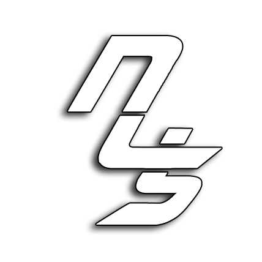

<div align="center">



**When you feel the need...for an awesome Python package!**

______________________________________________________________________

<p align="center">
  <a href="https://need4swede.netlify.app/">Documentation</a> •
  <a href="#installation">Installation</a> •
  <a href="#contributing">Contributing</a>
</p>

[](https://badge.fury.io/py/mlsync)
[](https://pepy.tech/project/mlsync)
[](https://mlsync.readthedocs.io/en/latest/)
[](https://join.slack.com/t/mlsync/shared_invite/zt-1ap8axys5-awwIfDGR8OWP1oFRKZp6OQ)
[](https://github.com/paletteml/mlsync/blob/master/LICENSE)

</div>

## Overview

### What is n4s?

This library isn't going to revolutionize how you use Python, but it will save you some money on hair loss treatments and ibuprofen. This package is an amalgamation of years spent writing Python code and trying to simplify certain common tasks to make them far more readable.

Whether you're new to Python or a veteran snake charmer, N4S is here to make your code cleaner, more intuative and easier to write.

## Installation

```sh
pip install n4s
```

### Why n4s?

Because writing Python code shouldn't be hard or tedious - regardless of experience and skill level.
This library expedites basic Python functionality, so you can focus on the more complex modules of your applications. This will help you save dev time, make your code cleaner and elminiate redundancy 

## Contributing

If you would like to contribute, please feel free to open an issue or pull request. Or, if you have any feedback or suggestions, please [contact ume](mailto:contact@mafshari.work) directly. I would be happy to hear from you!